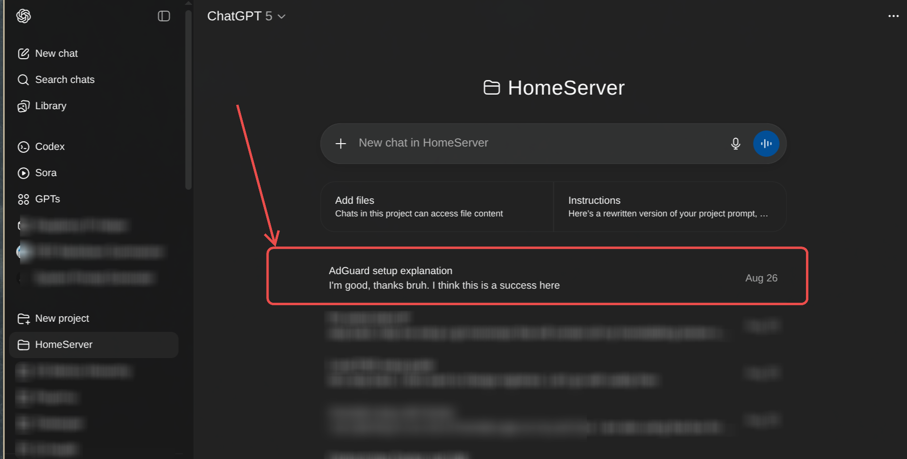

### AdGuard Home

1. **Setup environment variables:**
   ```bash
   cd services/network/adguard
   cp .env.example .env
   # Edit .env with your preferred settings
   ```

2. **Deploy AdGuard:**
   ```bash
   docker-compose up -d
   ```

3. **Access the web interface:**
   - Initial setup: `http://your-server-ip:3000`
   - Admin panel: `http://your-server-ip:3001` (after setup)

4. **Configure your router/devices:**
   - Set DNS server to your server's IP address
   - AdGuard will be listening on port 53

:info: Setting AmneziaVPN to work together with adguard

tldr: 

- disable amneziaDNS
- set 127.0.0.1 as DNS in amnezia settings
- disable killswitch in amnezia settings


